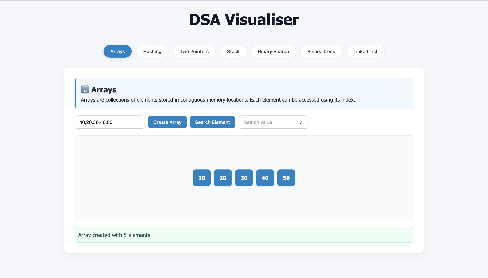

# DSA-Visualiser
This project is a DSA Visualizer, a web-based interactive tool that helps you visualise and understand common Data Structures and Algorithms

# Features
Arrays – create and search elements

Hash Tables – add, search, and clear key-value pairs

Two Pointers – find pairs for a target sum, check palindromes

Stacks – push, pop, peek with live visualization

Binary Search – step-by-step search on sorted arrays

Binary Trees – build, search, and traverse (inorder, preorder)

Linked Lists – add, remove, and search nodes

## 🖼️ Preview

